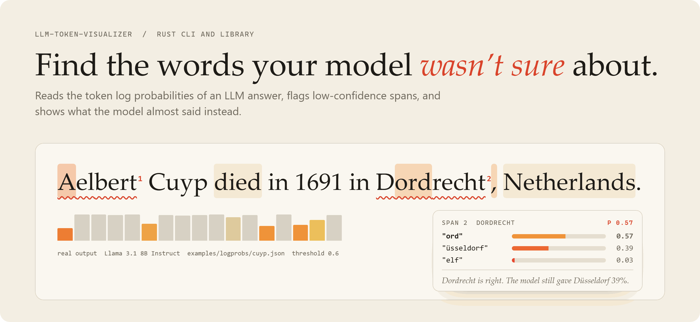
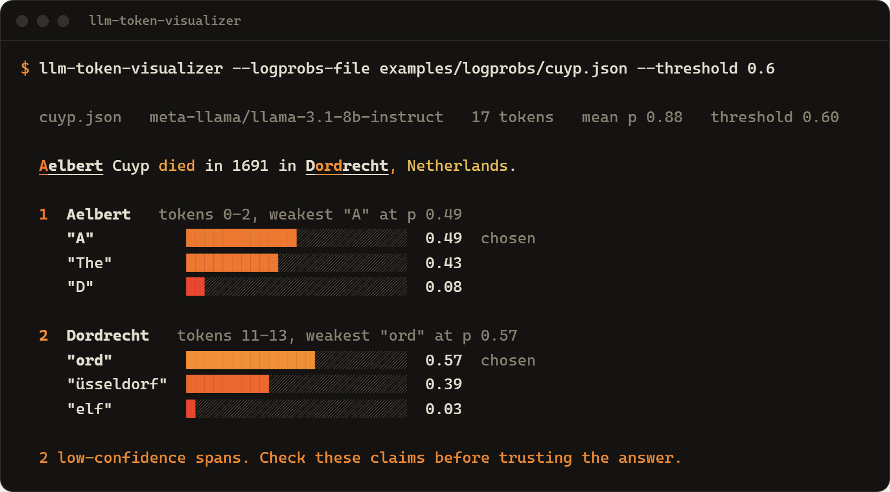
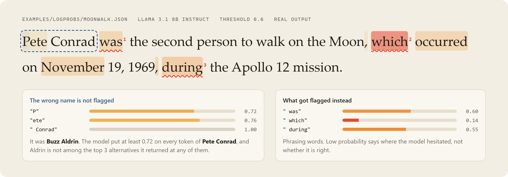

# LLM Hallucination Detector

**Highlights the words an AI chatbot was unsure about, so you know which parts of its answer to double-check.**

For anyone who ships or checks LLM answers: developers, evaluators, and CI pipelines. Works with OpenAI, OpenRouter, Together, vLLM, Ollama and any OpenAI-compatible API that returns token logprobs. Rust CLI and library (`llm-token-visualizer`).

**No install:** [try it in your browser](https://hallucination-highlighter.vercel.app/try/) (page source in [`docs/try/`](docs/try/index.html)). Play with the real sample answers and a threshold slider, or paste your own OpenAI, OpenRouter or Together key and ask a question. The key goes only from your browser to that provider.

<picture>
  <source media="(prefers-color-scheme: dark)" srcset="docs/assets/hero-dark.png">
  
</picture>

<p align="center">
  <a href="https://crates.io/crates/llm-token-visualizer"></a>
  &nbsp;<a href="https://hallucination-highlighter.vercel.app/try/"><b>Try it in the browser</b></a>
</p>

## Install

**Linux** (x86_64, Ubuntu 20.04+ / Debian 11+). One line, no dependencies, installs to `~/.local/bin`:

```sh
mkdir -p ~/.local/bin && curl -fsSL https://gitlab.com/mattbusel/LLM-Hallucination-Detection-Script/-/releases/permalink/latest/downloads/llm-token-visualizer-linux-x86_64.tar.gz | tar xz --strip-components=1 -C ~/.local/bin --wildcards '*/llm-token-visualizer'
```

| Other systems | |
|---|---|
| **Windows** | [Download llm-token-visualizer-windows-x86_64.exe](https://gitlab.com/mattbusel/LLM-Hallucination-Detection-Script/-/releases/permalink/latest/downloads/llm-token-visualizer-windows-x86_64.exe) and run it. (Unsigned, so SmartScreen may ask: *More info*, then *Run anyway*.) |
| **macOS, or from source** | `cargo install --locked llm-token-visualizer` |

The release archives also include the sample answers under `samples/`. Every release, with SHA-256 checksums: [Releases](https://gitlab.com/mattbusel/LLM-Hallucination-Detection-Script/-/releases).

**In GitLab CI:** fail a pipeline when a saved LLM answer has low-confidence words with the [`hallucination-gate`](https://gitlab.com/explore/catalog/mattbusel/llm-ci) CI/CD component.

## How it works



When a model writes an answer, it picks each token (a word or piece of a word) from a list of candidates, each with a probability. APIs expose these as `logprobs`. Hallucinations often sit where that probability drops: a name, a date, a city the model half-remembers. This tool turns the numbers into a heatmap and flags the shaky words, with the alternatives the model almost said. No model of its own, no API calls unless you ask for `--live`.

## Examples

Real answers from Llama 3.1 8B Instruct, bundled in `examples/logprobs/`. The first two of the four answers in the output of `cargo run --example detect` (threshold 0.6):

```text
examples/logprobs/cuyp.json
  answer: Aelbert Cuyp died in 1691 in Dordrecht, Netherlands.
  flagged "Aelbert": p=0.49 at "A"; model also considered "The" (0.43), "D" (0.08)
  flagged "Dordrecht": p=0.57 at "ord"; model also considered "üsseldorf" (0.39), "elf" (0.03)

examples/logprobs/tour-de-france.json
  answer: Stephen Roche won the 1987 Tour de France, riding for the Carrera Jeans-Vagabond team.
  flagged "Stephen": p=0.49 at "Stephen"; model also considered "The" (0.43), "Steven" (0.03)
  flagged "-Vagabond": p=0.57 at "-V"; model also considered "–" (0.21), " -" (0.14)
```

The Dordrecht answer is right, but the model gave Düsseldorf a 39% chance: exactly the kind of claim to double-check. The "Aelbert" flag is the model choosing between starting with the name or with "The": low probability can be about phrasing, not facts.

The terminal report for the first one (`--logprobs-file examples/logprobs/cuyp.json --threshold 0.6`):



### What it cannot tell you

<picture>
  <source media="(prefers-color-scheme: dark)" srcset="docs/assets/confidently-wrong-dark.png">
  
</picture>

Models can be confidently wrong. In `moonwalk.json` the model says "Pete Conrad was the second person to walk on the Moon" (it was Buzz Aldrin) with at least 72% probability on every token of the name, so the wrong name is not flagged. Use this to decide where to look first, not to certify an answer.

## Use it in 3 steps

1. **Get a response with logprobs.** Ask your API for `"logprobs": true, "top_logprobs": 3` and save the JSON, or let the tool do it: set `OPENAI_API_KEY` and run `llm-token-visualizer --live "your question" --save answer.json`.
2. **Run it:** `llm-token-visualizer --logprobs-file answer.json --threshold 0.6`
3. **Share or gate it:** `--format html -o report.html` for a page you can send, `--format markdown` for a PR comment, `--fail-on-flag` to fail a CI job when anything is flagged.

## Providers

`--live` asks a model and analyzes its answer. Pick where with `--provider` (default `openai`), and override the address with `--base-url`:

| `--provider` | Default base URL | Key from | Default `--model` | How it was checked |
|---|---|---|---|---|
| `openai` | `https://api.openai.com/v1` (or `OPENAI_BASE_URL`) | `OPENAI_API_KEY` | `gpt-4o-mini` | Docs (`logprobs`, `top_logprobs` up to 5). Request building unit-tested. |
| `openrouter` | `https://openrouter.ai/api/v1` | `OPENROUTER_API_KEY` | `openai/gpt-4o-mini` | Docs (`logprobs`, `top_logprobs`; support depends on the upstream provider, so the request sets `provider.require_parameters`). Request building unit-tested. |
| `together` | `https://api.together.ai/v1` | `TOGETHER_API_KEY` | none, pass `--model` | Docs (Together takes `"logprobs": <int>` rather than `true`, and the CLI sends that). Request building unit-tested. |
| `vllm` | `http://localhost:8000/v1` | `VLLM_API_KEY`, only if the server uses `--api-key` | none, pass `--model` | Docs (`logprobs`, `top_logprobs` in Chat Completions). Request building unit-tested. |
| `ollama` | `http://localhost:11434/v1` | no key | none, pass `--model` | **Real call** to Ollama 0.34.4 with `qwen2.5-coder:14b`: logprobs and top 3 alternatives came back. (Ollama's own OpenAI-compatibility page still lists logprobs as unsupported; older versions may not return them.) |

```sh
llm-token-visualizer --live "Who painted The Night Watch?" --provider ollama --model qwen2.5-coder:14b
llm-token-visualizer --live "Who painted The Night Watch?" --provider openrouter --save answer.json
llm-token-visualizer --live "..." --provider vllm --model my-model --base-url http://gpu-box:8000/v1
```

No hosted provider was called with a real key for this release. If a provider or model answers without logprobs, the CLI stops with an error that says so (and shows the answer) instead of printing an empty report. Anthropic's API does not return logprobs, so it has no preset.

No API key handy? Grab a sample first: `curl -LO https://gitlab.com/mattbusel/LLM-Hallucination-Detection-Script/-/raw/main/examples/logprobs/cuyp.json`

## Documentation

| | |
|---|---|
| [Reference](docs/REFERENCE.md) | Every flag, output formats (terminal, HTML, Markdown, JSON), CI use, input formats, live mode, your own confidence scores, library API |
| [How it works and repo layout](docs/ARCHITECTURE.md) | The detection rules and color scale in detail, source layout, what is a sketch and what ships |
| [API docs on docs.rs](https://docs.rs/llm-token-visualizer) | The Rust library |
| [Project site](https://hallucination-highlighter.vercel.app/) | Overview, with the samples and a threshold slider |
| [Try it in the browser](https://hallucination-highlighter.vercel.app/try/) | Samples, or ask OpenAI, OpenRouter or Together with your own key |
| [Changelog](CHANGELOG.md) | What changed in each release |

## License

MIT, see [LICENSE](LICENSE).
